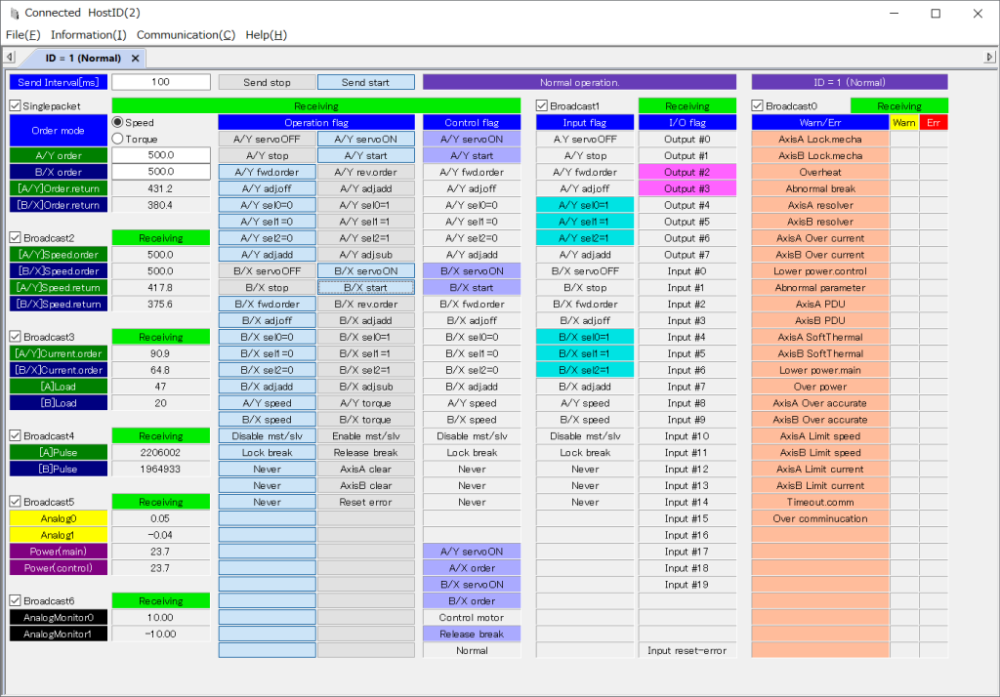

# gui_canABH3 (Sample for CANabh3.DLL)

<table width="100%" border="0">
<tr><th align="center" valign="center" bgcolor="blue">Software detail</th></tr>
<tr><td align="center" valign="center">

</td></tr>
</table>

<table border="0">
    <tr><td><h2>About this</h2>
        Sample software. (For CANabh3.DLL)
        </td>
    </tr>
</table>

<!-- Prerequisites -->
<table border="0">
    <tr><td><h2>Prerequisites</h2>
    <table border="1">
        <tr><th bgcolor="blue">Item</th><th bgcolor="blue">Information</th></tr>
        <tr><td align="center">OS</td><td align="center">Windows 10 or Windows 11</td></tr>
        <tr><td align="center">Compiler</td><td align="center">Microsoft Visual Studio 2019 or later.</td></tr>
        <tr><td align="center">DLL</td><td align="center">CANabh3.DLL , CANWACOUSB.DLL</td></tr>
    </table>
    </td></tr>
</table>

<!-- Version table -->
<table border="1">
   <tr><td><h2>History</h2>
    <table border="1">
        <tr>
            <th bgcolor="blue">Version</th>
            <th bgcolor="blue">Date</th>
            <th bgcolor="blue">Auth</th>
            <th bgcolor="blue">Notice</th>
        </tr>
        <tr>
            <td>1.0.0.18</td>
            <td>2024/04/08</td>
            <td>Y.OGAWA</td>
            <td>15th release Added the logging functionality for incoming/outgoing data. 
            (Logging control is in the preference dialog.)</td>
        </tr>
        <tr>
            <td>1.0.0.17</td>
            <td>2024/02/16</td>
            <td>Y.OGAWA</td>
            <td>14th release Added the ability to display incoming/outgoing data. 
            (Display control is in the preference dialog.)</td>
        </tr>
        <tr>
            <td>1.0.0.16</td>
            <td>2023/09/29</td>
            <td>Y.OGAWA</td>
            <td>13th release Changed some positions of displayed objects in host mode.</td>
        </tr>
        <tr>
            <td>1.0.0.15</td>
            <td>2023/09/25</td>
            <td>Y.OGAWA</td>
            <td>12th release Bugfix preference dialog.</td>
        </tr>
        <tr>
            <td>1.0.0.14</td>
            <td>2023/09/19</td>
            <td>Y.OGAWA</td>
            <td>11th release Changed to display only DLLs in the application folder.</td>
        </tr>
        <tr>
            <td>1.0.0.13</td>
            <td>2023/09/14</td>
            <td>Y.OGAWA</td>
            <td>10th release Fixed the some display strings.</td>
        </tr>
        <tr>
            <td>1.0.0.12</td>
            <td>2023/09/11</td>
            <td>Y.OGAWA</td>
            <td>9th release Update minor.</td>
        </tr>
        <tr>
            <td>1.0.0.11</td>
            <td>2023/08/31</td>
            <td>Y.OGAWA</td>
            <td>8th release Update minor.</td>
        </tr>
        <tr>
            <td>1.0.0.10</td>
            <td>2023/04/26</td>
            <td>Y.OGAWA</td>
            <td>7th release Change preference dialog.</td>
        </tr>
        <tr>
            <td>1.0.0.9</td>
            <td>2023/04/21</td>
            <td>Y.OGAWA</td>
            <td>6th release Bugfix.</td>
        </tr>
        <tr>
            <td>1.0.0.7 - 1.0.0.8</td>
            <td>-</td>
            <td>Y.OGAWA</td>
            <td>Minor update. (not release)</td>
        </tr>
        <tr>
            <td>1.0.0.6</td>
            <td>2023/03/31</td>
            <td>Y.OGAWA</td>
            <td>5th release Bugfix and some futures add.</td>
        </tr>
        <tr>
            <td>1.0.0.5</td>
            <td>2023/03/28</td>
            <td>Y.OGAWA</td>
            <td>4th release Update minor.</td>
        </tr>
        <tr>
            <td>1.0.0.4</td>
            <td>2023/03/27</td>
            <td>Y.OGAWA</td>
            <td>3rd release Bugfix and change UI.</td>
        </tr>
        <tr>
            <td>1.0.0.3</td>
            <td>2023/03/13</td>
            <td>Y.OGAWA</td>
            <td>2nd release Bugfix and change UI.</td>
        </tr>
        <tr>
            <td>1.0.0.2</td>
            <td>2023/03/09</td>
            <td>Y.OGAWA</td>
            <td>1st release</td>
        </tr>
    </table>
    </td></tr>
</table>

